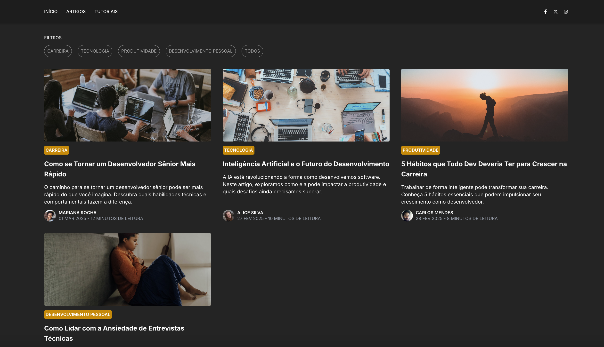
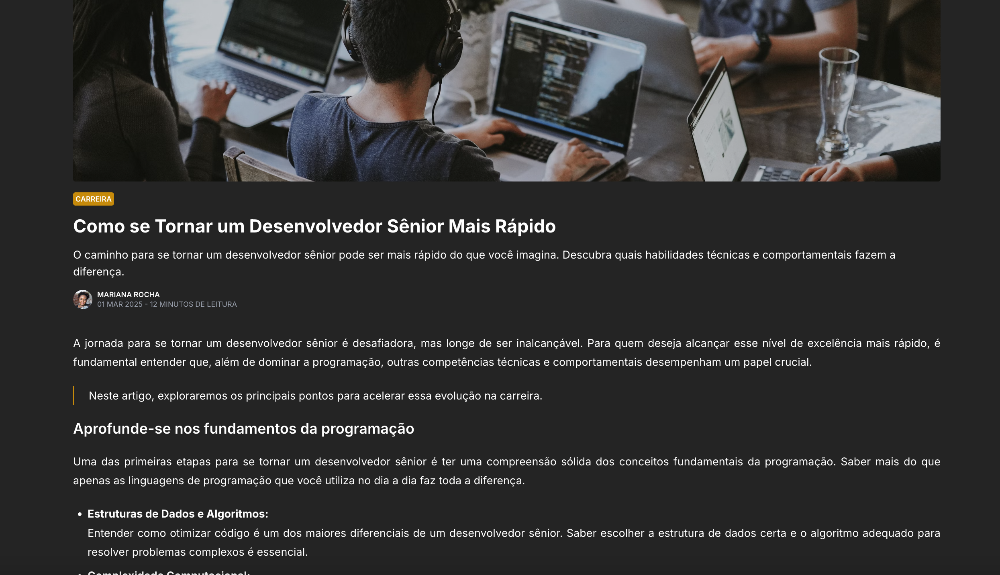

# Blog Pessoal

Este é um projeto de um blog pessoal desenvolvido em React com TypeScript. O objetivo do projeto é criar uma plataforma para exibir artigos, tutoriais e outros conteúdos organizados por categorias e tipos de documentos.

## Funcionalidades

- **Página Inicial**: Exibe os destaques e uma lista de documentos organizados.
- **Filtro por Categoria e Tipo**: Permite filtrar documentos por categorias e tipos específicos.
- **Página de Documentos**: Lista todos os documentos disponíveis com opções de filtro.
- **Página de Documento Detalhado**: Exibe o conteúdo completo de um documento selecionado.
- **Responsividade**: Layout adaptado para dispositivos móveis e desktops.

## Tecnologias Utilizadas

- **React**: Biblioteca para construção da interface do usuário.
- **TypeScript**: Superset do JavaScript para tipagem estática.
- **React Router**: Gerenciamento de rotas no frontend.
- **Tailwind CSS**: Framework CSS para estilização.

## Estrutura do Projeto

```plaintext
src/
├── assets/                # Arquivos estáticos e exemplos de dados
├── componentes/           # Componentes reutilizáveis (Navbar, Card, etc.)
├── interfaces/            # Definições de tipos e interfaces
├── paginas/               # Páginas principais do projeto (Inicio, Documentos, etc.)
├── services/              # Serviços para lógica de negócios e manipulação de dados
└── App.tsx                # Arquivo principal do aplicativo
```

## Como Executar o Projeto
1. **Clone o repositório**:
```git
git clone https://github.com/seu-usuario/blog-pessoal.git
cd blog-pessoal
```

2. **Instale as dependências**:
```cmd 
npm install
```

3. **Inicie o servidor de desenvolvimento**:
```cmd 
npm start
```

4. **Acesse no navegador**:
  - O projeto estará disponível em http://localhost:5173.

## Exemplos de Páginas
**Página Inicial**<br/>


**Página de Documentos**<br/>


**Página de Documento**<br/>


**Contribuição**<br/>
Contribuições são bem-vindas! Sinta-se à vontade para abrir issues ou enviar pull requests.

**Licença**<br/>
Este projeto está licenciado sob a MIT License.

Desenvolvido com ❤️ por Thaliys Daré.